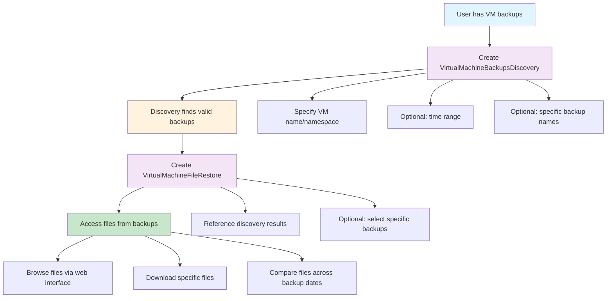
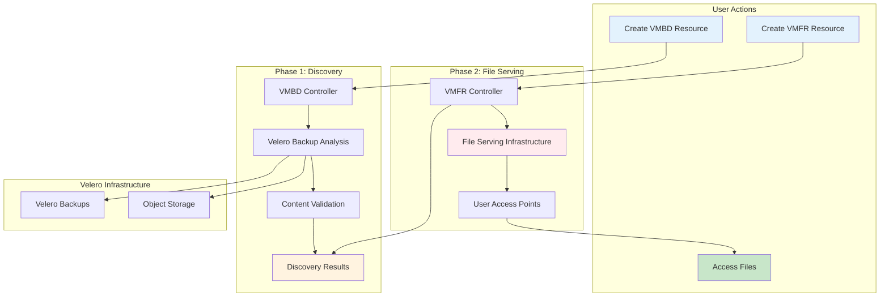

# OADP VM File Restore

## Overview

The OADP VM File Restore system enables users to access and restore individual files from virtual machine backups without performing a full VM restore. This is particularly useful for recovering specific configuration files, documents, or investigating file states at different points in time.

The system uses a two-phase approach that separates backup discovery from file serving, providing flexibility and reusability.

## User Workflow



## Phase 1: Backup Discovery

Users create a `VirtualMachineBackupsDiscovery` resource to find which backups contain their virtual machine.

### Discovery Options

**Time-based discovery:**
```yaml
apiVersion: oadp.openshift.io/v1alpha1
kind: VirtualMachineBackupsDiscovery
metadata:
  name: discover-vm-backups
spec:
  virtualMachineName: "my-vm"
  virtualMachineNamespace: "production"
  startTime: "2024-01-01"
  endTime: "2024-01-31"
```

**Explicit backup list:**
```yaml
apiVersion: oadp.openshift.io/v1alpha1
kind: VirtualMachineBackupsDiscovery
metadata:
  name: discover-specific-backups
spec:
  virtualMachineName: "my-vm"
  virtualMachineNamespace: "production"
  requestedBackups:
    - "backup-before-upgrade"
    - "backup-after-incident"
    - "weekly-backup-jan15"
```

### What Discovery Provides

The discovery process validates each backup to ensure it actually contains the specified VM, providing:

- **ValidBackups**: Confirmed backups containing the VM with timestamps
- **InvalidBackups**: Requested backups that don't contain the VM or weren't found
- **Detailed Progress**: Per-backup status and discovery statistics
- **Accurate Results**: No false positives through deep content validation

## Phase 2: File Serving

Users create a `VirtualMachineFileRestore` resource that references completed discovery results to set up file access.

### File Serving Options

**Serve all discovered backups:**
```yaml
apiVersion: oadp.openshift.io/v1alpha1
kind: VirtualMachineFileRestore
metadata:
  name: serve-all-backups
spec:
  backupsDiscoveryRef: "discover-vm-backups"
```

**Serve specific backups:**
```yaml
apiVersion: oadp.openshift.io/v1alpha1
kind: VirtualMachineFileRestore
metadata:
  name: serve-incident-backups
spec:
  backupsDiscoveryRef: "discover-vm-backups"
  selectedBackups:
    - "backup-before-upgrade"
    - "backup-after-incident"
```

## System Architecture



## Key Benefits

### Separation of Concerns
- **Discovery is reusable**: Multiple file restore operations can reference the same discovery
- **Independent scaling**: Discovery and file serving have different resource requirements
- **Clear responsibilities**: Discovery validates backups, file serving provides access

### Flexible Selection
- **Time-based discovery**: Find backups within date ranges using natural date formats
- **Explicit lists**: Specify exact backup names for targeted access
- **Selective serving**: Choose specific backups from discovery results for file access

### Accurate Results
- **Content validation**: Uses Velero APIs to verify backups actually contain the VM
- **Missing backup tracking**: Clear reporting of requested backups that don't exist
- **Real-time validation**: Checks backup availability at file serving time

## Use Cases

### Incident Investigation
1. Discover backups from before and after an incident
2. Serve files from those specific timepoints
3. Compare configuration files to identify changes

### Selective File Recovery
1. Discover recent backups containing the VM
2. Serve only the most recent backup
3. Download specific files without full VM restore

### Compliance and Auditing
1. Discover backups from specific date ranges
2. Serve files for audit review
3. Maintain access logs for compliance reporting

### Development and Testing
1. Discover backups from different development phases
2. Serve files from multiple backups simultaneously
3. Compare application configurations across versions

## Current Implementation Status

### ✅ Completed (Phase 1)
- **VirtualMachineBackupsDiscovery CRD**: Full implementation with comprehensive validation
- **Discovery Controller**: Complete discovery workflow with concurrent processing
- **Content Validation**: Backup inspection using Velero's download APIs
- **Status Reporting**: Detailed progress tracking and statistics

### 🚧 In Development (Phase 2)
- **VirtualMachineFileRestore CRD**: API structure and validation complete
- **File Restore Controller**: Discovery integration and backup validation complete
- **File Serving Infrastructure**: Implementation pending (design phase)

### 📋 Planned Features
- **File Access Interface**: Web UI and CLI tools for file browsing
- **Performance Optimization**: Efficient handling of large backup files
- **Multi-tenant Security**: Isolation and access control mechanisms
- **Advanced Monitoring**: Observability and troubleshooting tools

## Technical Deep Dive

For detailed technical information, see:

- **[VM Backup Discovery Mechanism](vm_backup_discovery_mechanism.md)**: Complete technical details of the discovery system, including algorithms, performance considerations, and API specifications
- **[VM File Restore Mechanism](vm_file_restore_mechanism.md)**: Technical implementation of file serving infrastructure, controller workflow, and integration patterns

## Getting Started

1. **Prerequisites**: Ensure OADP operator is installed with Velero backups available
2. **Create Discovery**: Define a VirtualMachineBackupsDiscovery resource with your VM details
3. **Monitor Progress**: Check discovery status and review found backups
4. **Set Up File Serving**: Create VirtualMachineFileRestore resource referencing your discovery
5. **Access Files**: Use provided endpoints to browse and download files (when available)

For detailed usage examples and configuration options, refer to the technical design documents linked above.