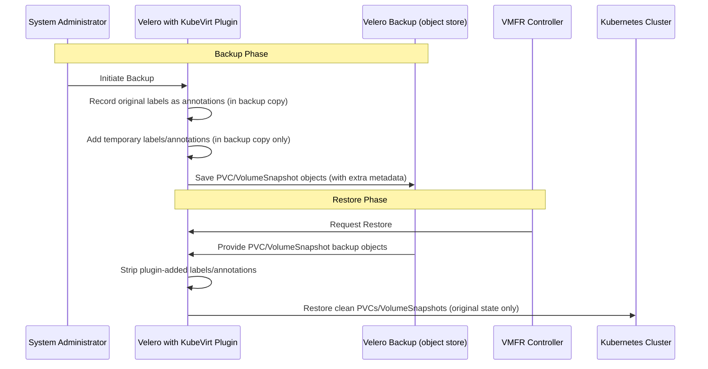

# Design Document: KubeVirt Selective Restore Solution with UID-Based Labeling

## 1. Introduction

This document outlines the design for a Velero selective restore mechanism that supports Virtual Machine File Restore scenarios in KubeVirt. The focus is on restoring only storage resources (Persistent Volume Claims and VolumeSnapshots) associated with specific Virtual Machines (VMs), while excluding VM definitions. The restore operation must be safe, scoped to the target VM, and capable of handling shared volumes.

The Virtual Machine File Restore Controller will coordinate this process by driving selective restore logic using Velero and associated backup metadata.

## 2. Problem Statement

In VM file restore workflow required by the VirtualMachineFileRestore (VMFR), it is necessary to restore only the storage resources (PVCs/VolumeSnapshots) used by a Virtual Machine, without restoring the VM object itself nor any additional objects.

Challenges:
 - VM objects are often GitOps-managed and must not be restored.
 - Volumes can be shared across multiple VMs in a single Velero backup.
 - Restore method (CSI, DataMover, native) is embedded in backup metadata and all mechanisms must be supported.
 - Velero cannot filter by resource name. Only label selectors and resource types are supported.
 - Kubernetes labels have limits:
   - Max 63 characters per key/value.
   - Max 64 labels per object.
   - Must follow DNS-compliant syntax.
 - Label limits must be considered. Too many VMs can exceed label count per object.

## 3. Goals

 - Only data volumes must be restored. VM and other resources must be excluded.
 - Restored objects must be traceable to their original VM.
 - Restore must work safely in a new temporary namespace.
 - Restore must support all data mover types: CSI, DataMover, native.
 - Restore must be scoped to a single target VirtualMachine.
 - Shared volumes must be restored once.
 - Label usage must be efficient and within Kubernetes limits.
 - Mechanism must allow VMFR Controller to generate valid Velero Restore objects with correct filters.

## 4. Proposed Solution

The solution relies on enhancements to the KubeVirt Velero Plugin, which will support both backup and restore operations. These enhancements are transparent to the VMFR Controller, which will continue to use standard Velero `Backup` and `Restore` objects with the appropriate configuration.

### Responsibilities

**KubeVirt Velero Plugin (enhanced):**
- Extends Velero to support selective backup and restore of KubeVirt data-only resources.
- Handles the data management logic transparently.

**VMFR Controller:**
- Triggers restores by creating Velero `Restore` objects.
- Provides the necessary configuration expected by the plugin to selectively restore objects associated with a given VM.

### 4.1. Backup Phase: Kubevirt Velero Plugin Enhancements

The existing KubeVirt Velero plugin will be enhanced to embed crucial metadata into backup objects. This metadata exists solely within the Velero backup and serves as the primary mechanism for scoping restore operations. It is never persisted to live cluster resources, and during a restore, the plugin uses it to guide the process while ensuring that the restored objects match their original state, without retaining any temporary backup-only data.

### 4.1.0. Plugin Registration

The enhanced plugin registers additional backup and restore actions with Velero:

**New Backup Actions:**
- `kubevirt-velero-plugin/backup-pvc-action`: Handles PVC labeling with UID information
- `kubevirt-velero-plugin/backup-volumesnapshot-action`: Handles VolumeSnapshot labeling based on source PVC UID

**New Restore Actions:**
- `kubevirt-velero-plugin/restore-volumesnapshot-action`: Handles VolumeSnapshot label cleanup during restore

These actions work alongside existing VM and VMI backup/restore actions to provide comprehensive selective restore capabilities.

### 4.1.1. Metadata Strategy (Labels and Annotations)

The KubeVirt Velero plugin will extend backup and restore actions for PVCs and VolumeSnapshots to manage additional labels and annotations used for selective restore. 

**Backup Action:**
- Add labels to PVCs and VolumeSnapshots (e.g., `velero.kubevirt.io/pvc-uid`) to record object identity using Kubernetes native UIDs.
- Before adding a label:
  - Preserve any existing label with the same key but different value.
  - If an existing label had a different value, record its original value in an annotation so it can be restored later.
- Ensure that object labels and annotations prior to the backup remain fully restorable.

**Restore Action:**
- Remove the temporary labels added during backup.
- If the object had original labels that were overwritten, restore them to their original values.
- Do not remove or modify labels that were identical to the backup-added labels unless they were added by the plugin itself.
- Remove stored information.
- Guarantee that after restore, the PVC and VolumeSnapshot objects match exactly their state prior to the backup.

**Notes:**
- The logic is implemented in:
  - `pkg/plugin/pvc_backup_item_action.go` / `_test.go`
  - `pkg/plugin/pvc_restore_item_action.go` / `_test.go`
  - `pkg/plugin/volumesnapshot_backup_item_action.go` / `_test.go`
  - `pkg/plugin/volumesnapshot_restore_item_action.go` / `_test.go`

**UID-Based Approach Benefits:**
- **Globally unique**: Kubernetes UIDs are guaranteed unique across all namespaces and clusters
- **Cross-namespace safe**: No conflicts when PVCs have identical names in different namespaces
- **Collision-resistant**: UIDs never conflict with user-defined labels
- **Precise targeting**: Exact object selection with no ambiguity
- **Kubernetes native**: Leverages existing infrastructure instead of creating new identifiers

No VM-specific labels are applied to shared resources. The VMFR Controller is responsible for mapping VirtualMachines to their associated resources based on this backup metadata, ensuring correct selective restore even when multiple VMs share the same PVC/VolumeSnapshot.

### 4.1.3. VolumeSnapshot Support

The implementation includes comprehensive support for VolumeSnapshots to enable CSI snapshot-based backup and restore:

**VolumeSnapshot Backup Action:**
- Identifies the source PVC for each VolumeSnapshot
- Applies the source PVC's UID as a label (`velero.kubevirt.io/pvc-uid`) to the VolumeSnapshot
- Handles collision detection by preserving existing label values in annotations
- Enables selective restore of VolumeSnapshots based on their source PVC relationship

**VolumeSnapshot Restore Action:**
- Removes plugin-added labels and restores original user labels if they existed
- Maintains the same collision-handling mechanism as PVC restore
- Ensures VolumeSnapshots are restored to their original state

This approach allows VolumeSnapshots to be selected for restore based on the PVC they originated from, enabling precise control over which storage snapshots are restored for a given VM.

### 4.1.4. Example 1: Non-conflicting labels

Original object (pseudo code)

```yaml
Namespace: virtualmachines
VirtualMachine: production-vm
    PVC name: data-pvc
      UID: 633ab84c-8529-487c-8848-99b40fbda9f5
      Labels: {}
      Annotations: {}
    VolumeSnapshot name: snap-1234
      UID: 789def01-2345-6789-abcd-ef0123456789
      Labels: {}
      Annotations: {}
      Source PVC: data-pvc
```

**Backup operation changes:**

```yaml
Namespace: virtualmachines
VirtualMachine: production-vm
    PVC name: data-pvc
      UID: 633ab84c-8529-487c-8848-99b40fbda9f5
      Labels:
        - velero.kubevirt.io/pvc-uid: 633ab84c-8529-487c-8848-99b40fbda9f5
      Annotations: {}
    VolumeSnapshot name: snap-1234
      UID: 789def01-2345-6789-abcd-ef0123456789
      Labels:
        - velero.kubevirt.io/pvc-uid: 633ab84c-8529-487c-8848-99b40fbda9f5
      Annotations: {}
      Source PVC: data-pvc
```

**Restore operation changes:**

```yaml
Removes the UID labels added to the PVC and VolumeSnapshot during backup, restoring the objects to their original state.
```

### 4.1.5. Example 2: Conflicting labels

Original object (pseudo code)

```yaml
Namespace: virtualmachines
VirtualMachine: production-vm
    PVC name: data-pvc
      UID: 633ab84c-8529-487c-8848-99b40fbda9f5
      Labels:
        - velero.kubevirt.io/pvc-uid: user-defined-value
      Annotations: {}
    VolumeSnapshot name: snap-1234
      UID: 789def01-2345-6789-abcd-ef0123456789
      Labels:
        - velero.kubevirt.io/pvc-uid: another-user-value
      Annotations: {}
      Source PVC: data-pvc

# Note: User accidentally used the same label keys as the plugin
```

**Backup operation changes:**

```yaml
Namespace: virtualmachines
VirtualMachine: production-vm
    PVC name: data-pvc
      UID: 633ab84c-8529-487c-8848-99b40fbda9f5
      Labels:
        - velero.kubevirt.io/pvc-uid: 633ab84c-8529-487c-8848-99b40fbda9f5
      Annotations:
        - velero.kubevirt.io/original-pvc-uid: user-defined-value
    VolumeSnapshot name: snap-1234
      UID: 789def01-2345-6789-abcd-ef0123456789
      Labels:
        - velero.kubevirt.io/pvc-uid: 633ab84c-8529-487c-8848-99b40fbda9f5
      Annotations:
        - velero.kubevirt.io/original-volumesnapshot-uid: another-user-value
      Source PVC: data-pvc
```

**Restore operation changes:**

```yaml
Replaces the UID labels with the original user values and removes added annotations, restoring the objects to their original state.
```


### 4.2. VMFR Controller Usage with UID-Based Selectors

The VMFR Controller can leverage the UID-based labeling for precise resource selection:

#### Single PVC Selection
```bash
# Restore specific PVC with it's VolumeSnapshot by UID
velero restore create --from-backup my-backup \
  --selector "velero.kubevirt.io/pvc-uid=633ab84c-8529-487c-8848-99b40fbda9f5" \
  --include-resources persistentvolumeclaims,volumesnapshots
```

#### Multiple PVC Selection
```bash
# Restore multiple PVCs and VolumeSnapshots associated with a VM
velero restore create --from-backup my-backup \
  --selector "velero.kubevirt.io/pvc-uid in (633ab84c-8529-487c-8848-99b40fbda9f5,another-pvc-uid)" \
  --include-resources persistentvolumeclaims,volumesnapshots
```

#### Cross-Namespace Restore
```bash
# Restore PVCs to different namespace - UIDs remain unique
velero restore create --from-backup my-backup \
  --selector "velero.kubevirt.io/pvc-uid=633ab84c-8529-487c-8848-99b40fbda9f5" \
  --namespace-mappings source-ns:target-ns \
  --include-resources persistentvolumeclaims,volumesnapshots
```

#### VolumeSnapshot Selection by Source PVC
```bash
# Restore VolumeSnapshots associated with specific PVCs
velero restore create --from-backup my-backup \
  --selector "velero.kubevirt.io/pvc-uid in (pvc-uid-1,pvc-uid-2)" \
  --include-resources volumesnapshots
```

**Advantages:**
- **No namespace conflicts**: UIDs work across all namespace scenarios
- **Exact targeting**: No ambiguity about which objects to restore
- **Scalable selection**: Can select multiple objects efficiently using `in` operator
- **Cross-cluster safe**: UIDs are unique even across different clusters

### 4.3. Label and Annotation Flow During Backup and Restore

This section shows the step-by-step flow of how temporary labels and annotations are added during backup and removed during restore by the kubevirt-velero-plugin. The diagram emphasizes that these changes exist only in the Velero backup copy and are never persisted to live Kubernetes resources.




## 5. Benefits

- **Handles shared data objects safely:**
  During restore, knowing the exact object UIDs associated with a given VM allows the plugin to restore only the relevant data objects. Shared PVCs and VolumeSnapshots are restored just once, and backups containing multiple VMs can selectively restore only the storage objects associated with a single VM, based on information from the VMFR controller.

- **Avoids resource conflicts:**
  Combining selective object restores with namespace mapping prevents resource name collisions.

- **Eliminates cross-namespace ambiguity:**
  UID-based labeling completely resolves conflicts when PVCs have identical names across different namespaces. Each object is uniquely identifiable regardless of namespace context.

- **Precise scope:**
  Restores only the necessary data, minimizing resource usage and potential conflicts.

- **Cross-cluster compatibility:**
  UIDs remain unique even when backups are restored to different clusters, providing reliable identification.

- **Clean separation:**
  Clearly separates VM definitions from their data, aligning with infrastructure-as-code principles.

- **Generic solution:**
  Works across various storage backends and Velero data movers (CSI, DataMover, Native).

- **Collision-resistant design:**
  Using Kubernetes-native UIDs virtually eliminates the risk of user label conflicts compared to name-based approaches.

## 6. Future Considerations

- Add native Velero support for selectors based on object uid or namespace/names in backup and restore operations.
